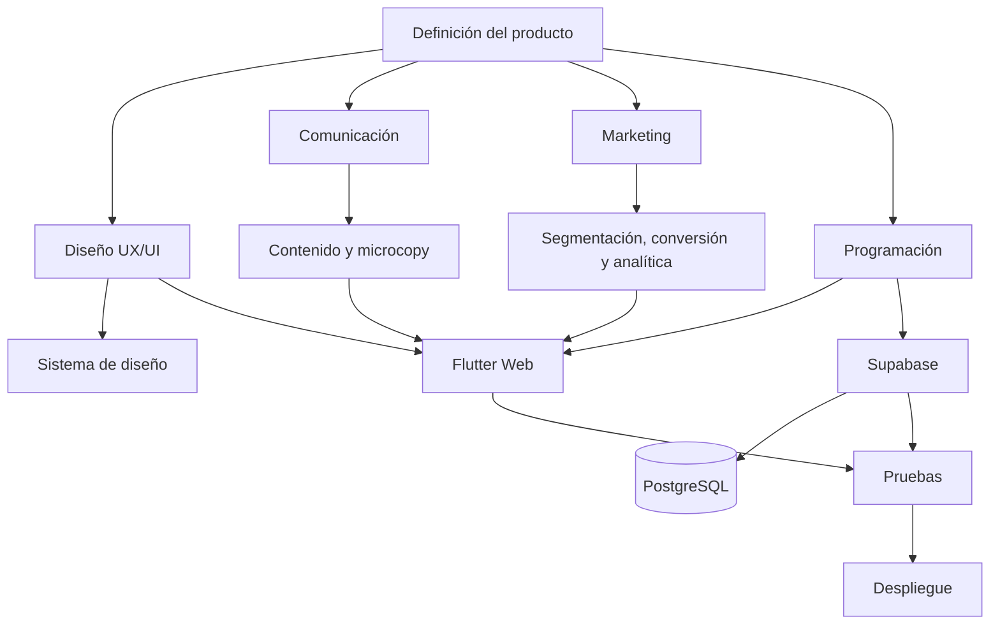
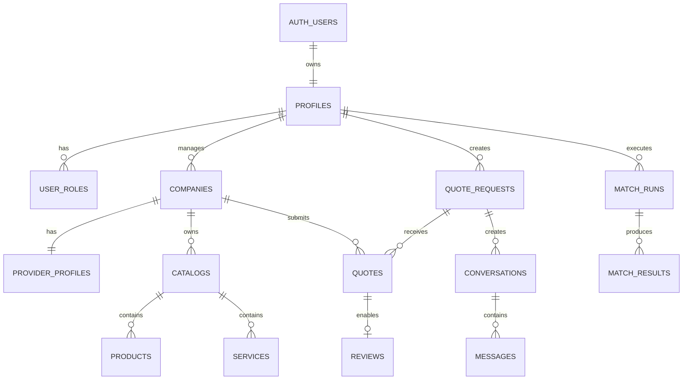

# PROVEO  
## README técnico-operativo multidisciplinario

**Proyecto:** Plataforma Inteligente para la Conexión de Emprendedores y Proveedores  
**Eslogan:** “Conectamos confianza. Impulsamos negocios.”  
**Tipo de solución:** Aplicación web responsive y PWA  
**Frontend:** Flutter Web  
**Lenguaje principal:** Dart  
**Backend y servicios:** Supabase  
**Base de datos:** PostgreSQL  
**Control de versiones:** Git y GitHub  
**Estado:** Planificación técnica e inicio de desarrollo  

---

# 1. Propósito de este documento

Este README funciona como documento técnico común para las áreas de:

- Diseño gráfico y experiencia de usuario.
- Comunicación.
- Marketing.
- Programación.
- Base de datos.
- Control de calidad.
- Administración del proyecto.
- Auditoría técnica.

Su finalidad es que todas las áreas trabajen sobre el mismo alcance, utilicen la misma terminología y entreguen recursos compatibles entre sí.

Este documento no sustituye el briefing, el prototipo, el plan de marketing, el manual de marca, el modelo de datos, el plan de pruebas ni el manual técnico. Los conecta y establece cómo deberán integrarse dentro del repositorio.

---

# 2. Fuente funcional del proyecto

El alcance funcional parte del documento **“PROVEO Hackathon”** compartido por el equipo.

La plataforma se define como una solución para conectar de forma segura, rápida y confiable a:

- Emprendedores.
- MIPYMES.
- Proveedores de productos.
- Proveedores de materias primas.
- Proveedores de servicios.

PROVEO centraliza información, reputación, comparación y recomendaciones para ayudar a seleccionar proveedores.

## 2.1 Regla de negocio principal

PROVEO:

- Facilita conexiones.
- Organiza información.
- Permite solicitar cotizaciones.
- Permite comparar alternativas.
- Apoya la toma de decisiones.
- Facilita la comunicación entre las partes.

PROVEO no:

- Procesa pagos.
- Realiza ventas directas.
- Maneja inventario transaccional como una tienda.
- Actúa como comercio electrónico tradicional.
- Sustituye la decisión final del usuario.

> La plataforma facilita la conexión entre oferta y demanda, pero la negociación y la decisión final corresponden a los usuarios.

---

# 3. Problema que resuelve

Actualmente, muchos emprendedores localizan proveedores mediante:

- Recomendaciones informales.
- Contactos personales.
- Facebook.
- WhatsApp.
- Búsquedas no estructuradas.
- Solicitudes de cotización separadas.
- Comparaciones manuales.

Esto provoca:

- Pérdida de tiempo.
- Información incompleta.
- Poca transparencia.
- Dificultad para comparar.
- Mayor riesgo en la decisión.
- Baja visibilidad para proveedores sin presencia digital.
- Escasa trazabilidad de solicitudes y respuestas.

PROVEO centraliza ese proceso en un sistema organizado y medible.

---

# 4. Objetivo general

Diseñar, desarrollar y desplegar una plataforma web inteligente que permita a emprendedores y MIPYMES encontrar, evaluar, comparar y contactar proveedores confiables mediante información estructurada, solicitudes de cotización, reputación y recomendaciones justificadas.

---

# 5. Objetivos específicos

1. Crear un directorio inteligente de proveedores verificados.
2. Implementar búsqueda por categoría, ubicación, producto, servicio y criterios de confianza.
3. Permitir que cada proveedor gestione un perfil empresarial completo.
4. Permitir la creación de catálogos digitales interactivos.
5. Gestionar solicitudes y respuestas de cotización.
6. Comparar cotizaciones mediante criterios configurables.
7. Implementar PROVEO Match como motor de recomendación explicable.
8. Mantener mensajería asociada a solicitudes.
9. Crear un sistema de reputación con reseñas verificadas.
10. Proporcionar paneles diferenciados para emprendedor, proveedor, administrador y auditor.
11. Mantener trazabilidad de acciones relevantes.
12. Aplicar control de versiones y trabajo colaborativo en GitHub.
13. Garantizar seguridad, accesibilidad, rendimiento y compatibilidad responsive.

---

# 6. Públicos del sistema

## 6.1 Emprendedor o MIPYME

Necesita:

- Encontrar proveedores.
- Comparar alternativas.
- Solicitar cotizaciones.
- Guardar favoritos.
- Revisar reputación.
- Recibir recomendaciones.
- Mantener conversaciones organizadas.

## 6.2 Proveedor

Necesita:

- Crear presencia profesional.
- Publicar productos y servicios.
- Recibir solicitudes.
- Responder cotizaciones.
- Gestionar mensajes.
- Mejorar reputación.
- Consultar estadísticas.

## 6.3 Administrador

Necesita:

- Gestionar usuarios.
- Aprobar proveedores.
- Administrar categorías.
- Moderar reseñas.
- Gestionar reportes.
- Supervisar actividad.
- Configurar reglas.
- Consultar estadísticas.

## 6.4 Auditor

Necesita:

- Consultar trazabilidad.
- Revisar acciones.
- Ver registros.
- Ver solicitudes y cotizaciones.
- Ver moderaciones.
- Exportar reportes autorizados.

El auditor tendrá acceso de solo lectura.

## 6.5 Visitante

Podrá:

- Conocer la plataforma.
- Consultar información pública.
- Buscar proveedores publicados.
- Ver perfiles públicos autorizados.
- Registrarse.
- Iniciar sesión.

---

# 7. Principios del producto

Todas las áreas deberán respetar estos principios:

## 7.1 Confianza

La información debe ser clara, verificable y coherente.

## 7.2 Transparencia

Las recomendaciones deben explicar por qué un proveedor aparece en determinada posición.

## 7.3 Neutralidad

La plataforma no debe presentar una recomendación como garantía absoluta.

## 7.4 Decisión humana

La decisión final siempre pertenece al usuario.

## 7.5 Trazabilidad

Las acciones críticas deben dejar registro.

## 7.6 Seguridad

Los datos y permisos deben controlarse desde backend y base de datos.

## 7.7 Accesibilidad

La interfaz debe ser comprensible, navegable y legible.

## 7.8 Escalabilidad

El proyecto deberá poder incorporar nuevas categorías, regiones, reglas y funcionalidades.

## 7.9 Consistencia

Diseño, contenido, base de datos y código deberán usar la misma terminología.

---

# 8. Alcance funcional

## 8.1 Página de inicio

La página principal deberá incluir:

- Logotipo.
- Menú principal.
- Hero.
- Mensaje de valor.
- Buscador rápido.
- Botón “Encontrar mi mejor proveedor”.
- Explicación del proceso en cuatro pasos.
- Beneficios.
- Categorías.
- Proveedores destacados.
- Testimonios.
- Estadísticas.
- Llamados a la acción.
- Pie de página.
- Enlaces legales.
- Acceso a registro e inicio de sesión.

Mensaje funcional de referencia:

> Encuentra proveedores confiables para hacer crecer tu negocio.

## 8.2 Buscador inteligente

Filtros mínimos:

- Palabra clave.
- Categoría.
- Departamento.
- Municipio.
- Tipo de proveedor.
- Producto.
- Servicio.
- Certificaciones.
- Disponibilidad.
- Calificación.
- Tiempo promedio de respuesta.
- Cobertura geográfica.
- Estado de verificación.

Cada resultado mostrará:

- Logo.
- Nombre comercial.
- Breve descripción.
- Ubicación.
- Verificación.
- Calificación.
- Número de reseñas.
- Tiempo promedio de respuesta.
- Cobertura.
- Botón “Ver perfil”.
- Botón “Solicitar cotización”.
- Botón “Guardar”.

## 8.3 PROVEO Match

El asistente recopilará:

- Producto o servicio requerido.
- Categoría.
- Ubicación.
- Presupuesto aproximado.
- Cantidad.
- Fecha requerida.
- Urgencia.
- Prioridad entre precio, calidad, rapidez y cercanía.
- Necesidad de certificaciones.
- Características adicionales.

Resultado:

- Ranking de cinco proveedores.
- Puntaje de compatibilidad.
- Razones de selección.
- Fortalezas.
- Limitaciones.
- Opción para consultar perfiles.
- Opción para solicitar cotización.

## 8.4 Comparador de cotizaciones

Criterios:

- Precio.
- Moneda.
- Impuestos.
- Costos adicionales.
- Tiempo de entrega.
- Condiciones de pago.
- Validez.
- Reputación.
- Distancia.
- Experiencia.
- Certificaciones.
- Tiempo de respuesta.
- Cumplimiento del requerimiento.

El sistema mostrará:

- Comparación visual.
- Datos faltantes.
- Fortalezas.
- Debilidades.
- Puntaje.
- Recomendación argumentada.
- Advertencia de que la decisión final corresponde al usuario.

## 8.5 Perfil del proveedor

Campos:

- Logo.
- Portada.
- Fotografías.
- Razón social.
- Nombre comercial.
- Historia.
- Misión.
- Visión.
- Años de experiencia.
- Ubicación.
- Departamento.
- Municipio.
- Cobertura.
- Horarios.
- Contacto.
- Redes sociales.
- Sitio web.
- Certificaciones.
- Sectores atendidos.
- Tiempo promedio de respuesta.
- Estado de verificación.
- Calificación.

## 8.6 Catálogo digital

Cada elemento deberá incluir:

- Fotografía.
- Nombre.
- Descripción.
- Categoría.
- Tipo.
- Presentaciones.
- Unidad de medida.
- Cantidad mínima.
- Disponibilidad.
- Tiempo de entrega.
- Certificaciones.
- Galería.
- Video opcional.
- Ficha técnica.
- PDF opcional.
- Botón “Solicitar cotización”.

## 8.7 Solicitudes de cotización

Una solicitud contendrá:

- Código.
- Usuario.
- Título.
- Descripción.
- Categoría.
- Producto o servicio.
- Cantidad.
- Presupuesto.
- Moneda.
- Fecha requerida.
- Ubicación.
- Prioridad.
- Características.
- Archivos.
- Proveedores seleccionados.
- Estado.
- Historial.

## 8.8 Cotizaciones

Una cotización contendrá:

- Solicitud.
- Proveedor.
- Detalle.
- Subtotal.
- Impuestos.
- Descuentos.
- Costos adicionales.
- Total.
- Moneda.
- Tiempo de entrega.
- Condiciones.
- Validez.
- Observaciones.
- Archivos.
- Estado.
- Fecha de envío.

## 8.9 Mensajería

- Conversación asociada a una solicitud.
- Participantes autorizados.
- Historial.
- Lectura.
- Archivos.
- Notificaciones.
- Moderación ante reporte.
- Registro de fecha y hora.

## 8.10 Reputación

Criterios:

- Calidad.
- Cumplimiento.
- Atención.
- Comunicación.
- Relación calidad-precio.

Reglas:

- Solo interacciones verificadas podrán generar reseñas.
- Una reseña deberá asociarse a una solicitud o cotización.
- El administrador podrá moderar.
- Toda moderación deberá quedar auditada.
- El promedio se calculará con reseñas válidas.
- La insignia “Proveedor Destacado” se aplicará bajo reglas configurables.
- La regla inicial propuesta en el documento es promedio superior a 4.5 y al menos diez reseñas verificadas.

## 8.11 Panel del emprendedor

- Inicio.
- Búsquedas.
- Solicitudes.
- Cotizaciones.
- Comparaciones.
- Mensajes.
- Favoritos.
- Recomendaciones.
- Notificaciones.
- Perfil.
- Configuración.

## 8.12 Panel del proveedor

- Inicio.
- Empresa.
- Catálogos.
- Productos.
- Servicios.
- Solicitudes.
- Cotizaciones.
- Mensajes.
- Estadísticas.
- Visitas.
- Reputación.
- Notificaciones.
- Configuración.

## 8.13 Panel del administrador

- Usuarios.
- Proveedores.
- Verificaciones.
- Categorías.
- Certificaciones.
- Reseñas.
- Reportes.
- Estadísticas.
- Configuración.
- Auditoría.
- Contenido.

## 8.14 Panel del auditor

- Actividades.
- Solicitudes.
- Cotizaciones.
- Comparaciones.
- Moderaciones.
- Aprobaciones.
- Exportaciones.
- Reportes.
- Historial.

---

# 9. Alcance fuera del MVP

No se desarrollará inicialmente:

- Pago en línea.
- Carrito de compras.
- Facturación electrónica.
- Gestión contable.
- Inventario transaccional.
- Logística de entrega.
- Contratos automáticos.
- Garantía comercial por parte de PROVEO.
- Aplicación móvil nativa independiente.

Estas funciones podrán evaluarse en fases posteriores.

---

# 10. Arquitectura multidisciplinaria



Ninguna disciplina trabaja aislada:

- Diseño define cómo se presenta.
- Comunicación define qué se dice.
- Marketing define para quién, con qué objetivo y cómo se mide.
- Programación implementa las reglas y la interacción.
- QA valida que el resultado sea funcional, seguro y consistente.
- Product Owner aprueba el alcance.

---

# 11. Stack tecnológico

| Capa | Tecnología |
|---|---|
| Aplicación web | Flutter Web |
| Lenguaje principal | Dart |
| Gestión de estado | Riverpod |
| Navegación | go_router |
| Modelos | Freezed y json_serializable |
| Backend | Supabase |
| Base de datos | PostgreSQL |
| Autenticación | Supabase Auth |
| Archivos | Supabase Storage |
| Tiempo real | Supabase Realtime |
| Funciones protegidas | Supabase Edge Functions |
| Lenguaje backend | TypeScript |
| Automatización | GitHub Actions |
| Repositorio | GitHub |
| Hosting | Firebase Hosting |
| Pruebas | flutter_test, integration_test, mocktail |
| Documentación | Markdown y Mermaid |
| Diseño | Figma o herramienta equivalente |
| Analítica | Herramienta definida por el equipo |
| Monitoreo | Supabase Logs y herramienta de errores |

## 11.1 Aclaración técnica

Flutter es un framework.

Dart es el lenguaje de programación principal.

PostgreSQL utilizará SQL.

Las funciones protegidas utilizarán TypeScript.

GitHub Actions utilizará YAML.

La documentación utilizará Markdown.

---

# 12. Arquitectura de software

Se aplicará una arquitectura por funcionalidades con separación entre:

- Presentación.
- Dominio.
- Datos.
- Infraestructura.
- Configuración.
- Servicios comunes.

```text
feature/
├── data/
│   ├── datasources/
│   ├── dto/
│   ├── mappers/
│   ├── repositories/
│   └── services/
├── domain/
│   ├── entities/
│   ├── repositories/
│   └── use_cases/
└── presentation/
    ├── controllers/
    ├── pages/
    ├── providers/
    └── widgets/
```

Reglas:

- Los widgets no contendrán lógica sensible.
- La UI no consultará directamente tablas sin una capa definida.
- Las operaciones privilegiadas se ejecutarán en backend.
- Las reglas de acceso se aplicarán con RLS.
- Las migraciones controlarán la base de datos.
- Los cambios se revisarán por Pull Request.

---

# 13. Estructura del repositorio

```text
proveo-platform/
├── .github/
│   ├── ISSUE_TEMPLATE/
│   ├── workflows/
│   ├── CODEOWNERS
│   └── PULL_REQUEST_TEMPLATE.md
├── apps/
│   └── proveo_web/
│       ├── lib/
│       │   ├── app/
│       │   ├── core/
│       │   ├── features/
│       │   └── main.dart
│       ├── test/
│       ├── integration_test/
│       ├── web/
│       └── pubspec.yaml
├── supabase/
│   ├── functions/
│   ├── migrations/
│   ├── tests/
│   ├── seed.sql
│   └── config.toml
├── design/
│   ├── brand/
│   ├── design-system/
│   ├── wireframes/
│   ├── prototypes/
│   ├── screens/
│   ├── assets/
│   ├── icons/
│   └── handoff/
├── communication/
│   ├── tone-of-voice/
│   ├── content-matrix/
│   ├── microcopy/
│   ├── legal/
│   ├── help-center/
│   └── releases/
├── marketing/
│   ├── research/
│   ├── segmentation/
│   ├── campaigns/
│   ├── analytics/
│   ├── experiments/
│   └── reports/
├── docs/
│   ├── product/
│   ├── architecture/
│   ├── database/
│   ├── api/
│   ├── security/
│   ├── testing/
│   ├── deployment/
│   ├── user-stories/
│   └── decisions/
├── qa/
│   ├── test-plans/
│   ├── test-cases/
│   ├── evidence/
│   └── reports/
├── scripts/
├── .gitignore
├── CHANGELOG.md
├── CONTRIBUTING.md
├── LICENSE
├── SECURITY.md
└── README.md
```

---

# 14. Convenciones de archivos

## 14.1 Reglas generales

- Minúsculas.
- Sin espacios.
- Usar guiones.
- Evitar nombres como `final`, `final2`, `nuevo` o `último`.
- Incluir versión cuando sea un entregable.
- Mantener una sola fuente oficial.

## 14.2 Diseño

```text
ds-button-primary-v1.fig
screen-home-desktop-v2.fig
screen-provider-profile-mobile-v1.fig
asset-icon-search.svg
asset-logo-proveo-horizontal.svg
```

## 14.3 Comunicación

```text
microcopy-login-v1.md
content-home-v2.md
faq-provider-verification-v1.md
release-notes-0.1.0.md
```

## 14.4 Marketing

```text
buyer-persona-entrepreneur-v1.md
campaign-provider-acquisition-v1.md
analytics-event-map-v1.csv
experiment-home-cta-001.md
```

## 14.5 Programación

Dart:

```text
provider_profile_page.dart
quote_request_repository.dart
run_proveo_match_use_case.dart
```

SQL:

```text
20260728090000_create_profiles.sql
20260728100000_create_companies.sql
```

---

# 15. Flujo de trabajo en GitHub

## 15.1 Ramas

| Rama | Uso |
|---|---|
| `main` | Producción |
| `develop` | Integración |
| `feature/*` | Funcionalidad |
| `fix/*` | Corrección |
| `hotfix/*` | Corrección urgente |
| `design/*` | Entregables de diseño |
| `content/*` | Contenido |
| `marketing/*` | Marketing |
| `docs/*` | Documentación |
| `test/*` | Pruebas |
| `release/*` | Preparación de versión |

Ejemplos:

```text
feature/42-provider-search
design/31-provider-card
content/45-home-microcopy
marketing/52-conversion-events
fix/68-quote-total
```

## 15.2 Commits

Formato:

```text
tipo(alcance): descripción
```

Ejemplos:

```text
feat(search): agregar filtro por municipio
design(cards): actualizar estados de tarjeta
content(home): ajustar mensaje principal
marketing(analytics): definir evento de cotización
fix(quotes): corregir cálculo total
docs(database): actualizar diccionario
```

Tipos:

- `feat`
- `fix`
- `design`
- `content`
- `marketing`
- `docs`
- `test`
- `refactor`
- `ci`
- `build`
- `chore`

## 15.3 Pull Request

Debe contener:

- Descripción.
- Issue relacionado.
- Área responsable.
- Evidencia.
- Capturas.
- Pasos de prueba.
- Impacto.
- Riesgos.
- Cambios en base de datos.
- Cambios de contenido.
- Cambios de analítica.
- Lista de verificación.

## 15.4 Protección de ramas

`main` y `develop` deberán:

- Bloquear push directo.
- Exigir Pull Request.
- Exigir aprobación.
- Exigir CI aprobado.
- Exigir conversaciones resueltas.
- Bloquear force push.
- Bloquear eliminación.
- Exigir revisión de CODEOWNERS.

---

# 16. Gestión del trabajo

Se recomienda GitHub Projects con columnas:

```text
Backlog
Ready
In progress
Review
QA
Blocked
Done
```

Cada Issue deberá incluir:

- Título.
- Tipo.
- Descripción.
- Responsable.
- Disciplina.
- Dependencias.
- Criterios de aceptación.
- Evidencia requerida.
- Prioridad.
- Sprint o fecha objetivo.

## 16.1 Definition of Ready

Una tarea está lista cuando:

- Tiene objetivo claro.
- Tiene responsable.
- Tiene criterios de aceptación.
- Tiene diseño o referencia.
- Tiene contenido aprobado si aplica.
- Tiene datos definidos.
- Tiene dependencias identificadas.
- No presenta bloqueos desconocidos.

## 16.2 Definition of Done

Una tarea está terminada cuando:

- Cumple criterios.
- Está revisada.
- Tiene pruebas.
- Es responsive.
- Cumple accesibilidad.
- Incluye estados.
- No contiene secretos.
- Respeta seguridad.
- Actualiza documentación.
- Pasa CI.
- Tiene evidencia.
- Fue fusionada mediante Pull Request.

---

# 17. Responsabilidades por disciplina

# 17.1 Diseño gráfico y UX/UI

## Objetivo

Convertir el alcance funcional en una interfaz coherente, accesible, responsive y preparada para implementación.

## Entregables obligatorios

- Manual de marca.
- Logotipo en formatos editables.
- Paleta.
- Tipografía.
- Sistema de iconografía.
- Retícula.
- Design tokens.
- Biblioteca de componentes.
- Wireframes.
- Prototipos.
- Estados responsive.
- Estados de interacción.
- Handoff.
- Guía de uso de imágenes.
- Especificaciones de accesibilidad.

## Sistema de diseño

Debe definir:

### Colores

- Primario.
- Secundario.
- Acento.
- Fondo.
- Superficie.
- Texto principal.
- Texto secundario.
- Éxito.
- Advertencia.
- Error.
- Información.
- Bordes.
- Estados deshabilitados.

Los colores deben incluir:

- Código HEX.
- RGB.
- Uso.
- Contraste.
- Variantes.

### Tipografía

- Familia.
- Pesos.
- Tamaños.
- Alturas de línea.
- Jerarquías.
- Uso para títulos, cuerpo, etiquetas y botones.

### Espaciado

Escala recomendada:

```text
4, 8, 12, 16, 24, 32, 40, 48, 64
```

### Componentes mínimos

- Botón.
- Campo de texto.
- Selector.
- Buscador.
- Filtro.
- Checkbox.
- Radio.
- Chip.
- Etiqueta.
- Badge.
- Tarjeta de proveedor.
- Tarjeta de producto.
- Tarjeta de cotización.
- Tabla.
- Modal.
- Alert.
- Toast.
- Breadcrumb.
- Paginación.
- Menú.
- Sidebar.
- Tabs.
- Avatar.
- Carga.
- Estado vacío.
- Estado de error.
- Estado sin conexión.

## Estados que cada componente debe tener

- Default.
- Hover.
- Focus.
- Active.
- Disabled.
- Loading.
- Error.
- Success.

## Puntos de corte

- Móvil: menos de 600 px.
- Tableta: 600 a 1023 px.
- Escritorio: 1024 a 1439 px.
- Escritorio amplio: 1440 px o más.

## Handoff

Cada pantalla debe indicar:

- Nombre.
- Ruta.
- Objetivo.
- Rol.
- Componentes.
- Comportamientos.
- Estados.
- Validaciones.
- Contenido.
- Eventos analíticos.
- Datos requeridos.
- Enlaces al prototipo.
- Medidas.
- Assets exportables.

## Regla de diseño

No entregar únicamente una imagen estática. El programador necesita componentes, medidas, variantes, estados y reglas responsive.

---

# 17.2 Comunicación

## Objetivo

Definir contenido claro, coherente, confiable y comprensible en toda la plataforma.

## Entregables obligatorios

- Guía de tono y voz.
- Glosario.
- Matriz de contenido.
- Microcopy.
- Preguntas frecuentes.
- Mensajes transaccionales.
- Mensajes de validación.
- Mensajes de error.
- Textos de onboarding.
- Ayuda contextual.
- Notificaciones.
- Correos.
- Términos y políticas, con revisión correspondiente.
- Notas de versión.

## Tono

Debe ser:

- Claro.
- Profesional.
- Cercano.
- Confiable.
- Directo.
- No exagerado.
- No discriminatorio.
- No ambiguo.

## Terminología oficial

Usar:

- Emprendedor.
- MIPYME.
- Proveedor.
- Solicitud de cotización.
- Cotización.
- Comparación.
- Proveedor verificado.
- Proveedor destacado.
- PROVEO Match.
- Catálogo digital.
- Recomendación.
- Reputación.

Evitar mezclar:

- Oferta con cotización.
- Empresa con usuario.
- Compra con solicitud.
- Vendedor con proveedor.
- Marketplace con plataforma.

## Matriz de contenido

Cada texto deberá registrar:

| Campo | Descripción |
|---|---|
| ID | Código único |
| Ruta | Pantalla |
| Elemento | Título, botón, error, ayuda |
| Texto | Contenido |
| Objetivo | Qué debe lograr |
| Público | Rol |
| Estado | Borrador, revisión, aprobado |
| Responsable | Autor |
| Versión | Control |
| Observación | Restricción |

## Microcopy

Debe cubrir:

- Registro.
- Inicio de sesión.
- Recuperación.
- Formularios.
- Carga.
- Confirmaciones.
- Errores.
- Eliminaciones.
- Reportes.
- Aprobaciones.
- Cotizaciones.
- Mensajes.
- Reseñas.
- Recomendaciones.

Ejemplo:

Incorrecto:

> Error 403.

Correcto:

> No tienes permiso para realizar esta acción. Verifica tu cuenta o comunícate con soporte.

## Mensajes de recomendación

Deben:

- Explicar criterios.
- Evitar promesas.
- Señalar datos faltantes.
- Recordar que la decisión es del usuario.
- No presentar inteligencia artificial como autoridad absoluta.

---

# 17.3 Marketing

## Objetivo

Validar segmentos, atraer usuarios adecuados, medir conversión y apoyar el crecimiento de la plataforma.

## Segmentos base

### Demanda

- Emprendedores.
- MIPYMES.
- Personas que buscan materias primas.
- Empresas que requieren servicios.

### Oferta

- Proveedores de productos.
- Proveedores de materias primas.
- Proveedores de servicios.
- Empresas con baja presencia digital.

## Propuesta de valor

Para emprendedores:

> Encontrar y comparar proveedores confiables desde un solo lugar.

Para proveedores:

> Obtener mayor visibilidad y nuevas oportunidades comerciales mediante un perfil profesional.

## Entregables obligatorios

- Investigación.
- Segmentación.
- Buyer personas.
- Customer journey.
- Propuesta de valor.
- Mensajes por segmento.
- Estrategia de adquisición.
- Embudo.
- Plan de contenidos.
- Campañas.
- Eventos analíticos.
- Panel de métricas.
- Experimentos.
- Informe de resultados.

## Embudo

```text
Descubrimiento
Registro
Activación
Búsqueda
Solicitud
Respuesta
Comparación
Contacto
Retención
Recomendación
```

## Eventos analíticos

Convención:

```text
objeto_accion
```

Eventos iniciales:

```text
home_viewed
search_started
search_filter_applied
provider_profile_viewed
provider_saved
match_started
match_completed
quote_request_started
quote_request_submitted
quote_received
quote_compared
provider_contacted
review_submitted
provider_registration_started
provider_profile_completed
catalog_item_published
```

Cada evento deberá indicar:

- Nombre.
- Descripción.
- Pantalla.
- Disparador.
- Propiedades.
- Rol.
- Responsable.
- Uso.

## KPI

- Registros.
- Perfiles completados.
- Proveedores verificados.
- Búsquedas.
- Solicitudes.
- Cotizaciones.
- Tiempo de respuesta.
- Comparaciones.
- Contactos.
- Reseñas.
- Retención.
- Conversión por etapa.

No se establecerán metas numéricas sin investigación y aprobación.

## UTM

Formato:

```text
utm_source
utm_medium
utm_campaign
utm_content
utm_term
```

Ejemplo:

```text
utm_source=facebook
utm_medium=social
utm_campaign=proveo_lanzamiento
utm_content=video_proveedores
```

## Experimentos

Cada prueba deberá documentar:

- Hipótesis.
- Segmento.
- Variable.
- Métrica.
- Duración.
- Resultado.
- Decisión.
- Evidencia.

---

# 17.4 Programación

## Objetivo

Implementar el producto con código seguro, mantenible, probado y versionado.

## Responsabilidades

- Configurar Flutter.
- Crear arquitectura.
- Implementar UI.
- Integrar Supabase.
- Diseñar base de datos.
- Crear migraciones.
- Crear RLS.
- Implementar funciones.
- Crear pruebas.
- Configurar CI/CD.
- Gestionar errores.
- Documentar.
- Desplegar.

## Dependencias base

```bash
flutter pub add flutter_riverpod
flutter pub add go_router
flutter pub add supabase_flutter
flutter pub add freezed_annotation
flutter pub add json_annotation
flutter pub add intl
flutter pub add uuid
flutter pub add flutter_svg
flutter pub add cached_network_image
flutter pub add file_picker
flutter pub add url_launcher

flutter pub add dev:build_runner
flutter pub add dev:freezed
flutter pub add dev:json_serializable
flutter pub add dev:flutter_lints
flutter pub add dev:mocktail
```

## Reglas

- No usar `dynamic` sin justificación.
- No colocar claves privadas en Flutter.
- No confiar en permisos visuales.
- Manejar loading, empty y error.
- Implementar validación.
- Agregar pruebas.
- Documentar decisiones.
- Mantener archivos pequeños.
- Separar lógica y UI.
- Usar modelos tipados.
- Capturar errores.
- No ignorar excepciones.

---

# 18. Rutas de la aplicación

```text
/
├── /como-funciona
├── /proveedores
├── /proveedores/:slug
├── /categorias/:slug
├── /buscar
├── /match
├── /login
├── /registro
├── /recuperar-contrasena
├── /app
│   ├── /inicio
│   ├── /busquedas
│   ├── /solicitudes
│   ├── /solicitudes/:id
│   ├── /cotizaciones
│   ├── /comparaciones
│   ├── /mensajes
│   ├── /favoritos
│   ├── /perfil
│   └── /configuracion
├── /proveedor
│   ├── /inicio
│   ├── /empresa
│   ├── /catalogos
│   ├── /productos
│   ├── /servicios
│   ├── /solicitudes
│   ├── /cotizaciones
│   ├── /mensajes
│   ├── /estadisticas
│   └── /reputacion
├── /admin
│   ├── /usuarios
│   ├── /proveedores
│   ├── /categorias
│   ├── /certificaciones
│   ├── /resenas
│   ├── /reportes
│   ├── /configuracion
│   └── /auditoria
└── /auditor
    ├── /actividad
    ├── /solicitudes
    ├── /cotizaciones
    ├── /comparaciones
    └── /reportes
```

---

# 19. Modelo de datos

## 19.1 Tablas principales

| Tabla | Finalidad |
|---|---|
| `profiles` | Datos de usuario |
| `user_roles` | Roles |
| `companies` | Empresas |
| `provider_profiles` | Perfil de proveedor |
| `provider_verifications` | Verificación |
| `categories` | Categorías |
| `departments` | Departamentos |
| `municipalities` | Municipios |
| `catalogs` | Catálogos |
| `products` | Productos |
| `services` | Servicios |
| `certifications` | Certificaciones |
| `company_certifications` | Certificaciones de empresa |
| `quote_requests` | Solicitudes |
| `quote_request_items` | Detalle solicitado |
| `quote_request_providers` | Proveedores invitados |
| `quotes` | Cotizaciones |
| `quote_items` | Detalle cotizado |
| `quote_comparisons` | Comparaciones |
| `conversations` | Conversaciones |
| `messages` | Mensajes |
| `reviews` | Reseñas |
| `review_ratings` | Calificaciones |
| `favorites` | Favoritos |
| `notifications` | Notificaciones |
| `match_runs` | Ejecuciones de Match |
| `match_results` | Resultados de Match |
| `reports` | Reportes |
| `audit_logs` | Auditoría |
| `system_settings` | Configuración |

## 19.2 Relaciones



## 19.3 Roles

```sql
guest
entrepreneur
provider
administrator
auditor
```

## 19.4 Estados de solicitud

```sql
draft
published
sent
in_review
answered
selected
closed
cancelled
expired
```

## 19.5 Estados de cotización

```sql
draft
submitted
viewed
under_review
accepted
rejected
withdrawn
expired
```

## 19.6 Reglas de datos

- UUID.
- Fechas UTC.
- `created_at`.
- `updated_at`.
- `deleted_at` cuando aplique.
- Integridad referencial.
- Restricciones.
- Índices.
- Auditoría.
- Borrado lógico.
- Migraciones.

---

# 20. Seguridad de base de datos

Todas las tablas expuestas deberán habilitar RLS.

Políticas mínimas:

- El público consulta proveedores aprobados.
- El usuario consulta su perfil.
- El emprendedor administra sus solicitudes.
- El proveedor administra su empresa.
- Solo participantes leen conversaciones.
- Solo participantes envían mensajes.
- Solo el propietario administra favoritos.
- Administrador y auditor usan permisos controlados.
- Nadie escribe directamente en auditoría desde frontend.

Ejemplo:

```sql
alter table public.quote_requests enable row level security;

create policy "entrepreneur_reads_own_requests"
on public.quote_requests
for select
to authenticated
using (created_by = auth.uid());

create policy "entrepreneur_creates_own_requests"
on public.quote_requests
for insert
to authenticated
with check (created_by = auth.uid());
```

---

# 21. Funciones de backend

## `approve-provider`

- Verificar administrador.
- Aprobar o rechazar.
- Registrar motivo.
- Guardar auditoría.
- Notificar.

## `run-proveo-match`

- Validar respuestas.
- Filtrar proveedores.
- Calcular puntajes.
- Guardar resultados.
- Explicar recomendación.

## `compare-quotes`

- Validar acceso.
- Normalizar criterios.
- Comparar.
- Identificar datos faltantes.
- Guardar resultado.
- Devolver explicación.

## `send-notification`

- Crear notificación.
- Aplicar preferencias.
- Evitar duplicados.
- Enviar correo cuando aplique.

## `export-audit-report`

- Validar rol.
- Aplicar filtros.
- Generar archivo.
- Registrar exportación.
- Entregar enlace temporal.

---

# 22. Contrato de PROVEO Match

## Entrada

```json
{
  "categoryId": "uuid",
  "departmentId": "uuid",
  "municipalityId": "uuid",
  "budgetMin": 0,
  "budgetMax": 0,
  "quantity": 0,
  "urgency": "medium",
  "priority": "quality",
  "requiresCertification": true,
  "requiredDate": "2026-08-15",
  "attributes": []
}
```

## Salida

```json
{
  "matchRunId": "uuid",
  "algorithmVersion": "1.0.0",
  "results": [
    {
      "providerId": "uuid",
      "score": 92.5,
      "position": 1,
      "reasons": [
        "Coincide con la categoría solicitada",
        "Cubre el municipio seleccionado",
        "Tiene buena reputación"
      ],
      "warnings": []
    }
  ]
}
```

## Reglas

- Solo proveedores aprobados.
- Puntajes configurables.
- Explicación obligatoria.
- Versión del algoritmo.
- Registro de criterios.
- Decisión final humana.

---

# 23. Diseño de estados de pantalla

Toda pantalla debe contemplar:

- Cargando.
- Sin datos.
- Sin resultados.
- Error.
- Sin conexión.
- Permiso denegado.
- Sesión vencida.
- Acción exitosa.
- Acción en proceso.
- Contenido parcial.
- Datos incompletos.

Ejemplo para búsqueda:

- Resultados encontrados.
- No hay coincidencias.
- Filtros inválidos.
- Error de conexión.
- Proveedor no disponible.

---

# 24. Accesibilidad

Requisitos:

- Navegación por teclado.
- Orden de foco.
- Foco visible.
- Contraste.
- Tamaño legible.
- Etiquetas.
- Texto alternativo.
- Semántica.
- No depender únicamente del color.
- Mensajes claros.
- Formularios accesibles.
- Botones con nombre.
- Reducción de animación cuando aplique.
- Diseño adaptable.

---

# 25. Rendimiento

Objetivos técnicos:

- Optimizar imágenes.
- Usar SVG cuando corresponda.
- Cargar listas por páginas.
- Evitar consultas innecesarias.
- Usar índices.
- Implementar caché.
- Evitar reconstrucciones excesivas.
- Comprimir assets.
- Dividir cargas.
- Medir rendimiento.

No publicar imágenes sin optimizar.

---

# 26. SEO y contenido público

Flutter Web se utilizará para la experiencia interactiva.

Las áreas de comunicación, marketing y programación deberán revisar:

- Títulos.
- Descripciones.
- URLs.
- Datos estructurados.
- Open Graph.
- Sitemap.
- Robots.
- Canonical.
- Páginas públicas.
- Rendimiento.
- Indexación.

Las páginas de proveedores deberán evaluarse especialmente porque son contenido público de alto valor.

---

# 27. Analítica

## Propiedades comunes

```text
user_role
user_id_anonymous
session_id
page_path
provider_id
category_id
department_id
municipality_id
source
campaign
device_type
```

No enviar:

- Contraseñas.
- Tokens.
- Mensajes privados.
- Archivos.
- Documentos.
- Datos sensibles innecesarios.

---

# 28. Configuración de ambientes

```text
development
staging
production
```

Cada ambiente deberá tener:

- Supabase separado.
- Base de datos separada.
- Claves separadas.
- Hosting separado.
- Datos separados.
- Logs separados.
- Configuración separada.

Ejemplo:

```json
{
  "APP_ENV": "development",
  "SUPABASE_URL": "https://PROJECT_ID.supabase.co",
  "SUPABASE_PUBLISHABLE_KEY": "PUBLIC_KEY",
  "APP_BASE_URL": "http://localhost:3000"
}
```

Nunca almacenar `service_role` en Flutter.

---

# 29. Instalación

## Requisitos

- Git.
- Flutter.
- Dart.
- Chrome.
- Supabase CLI.
- Firebase CLI.
- Cuenta GitHub.
- Acceso al proyecto Supabase.

## Clonar

```bash
git clone https://github.com/ORGANIZACION/proveo-platform.git
cd proveo-platform
```

## Instalar

```bash
cd apps/proveo_web
flutter pub get
```

## Ejecutar

```bash
flutter run -d chrome \
  --dart-define-from-file=../../config/env/development.json
```

## Validar

```bash
dart format --output=none --set-exit-if-changed .
flutter analyze
flutter test
```

## Compilar

```bash
flutter build web --release \
  --dart-define-from-file=../../config/env/production.json
```

---

# 30. Integración continua

```yaml
name: CI

on:
  pull_request:
    branches:
      - main
      - develop
  push:
    branches:
      - main
      - develop

permissions:
  contents: read

jobs:
  flutter-quality:
    runs-on: ubuntu-latest

    defaults:
      run:
        working-directory: apps/proveo_web

    steps:
      - name: Descargar repositorio
        uses: actions/checkout@v4

      - name: Configurar Flutter
        uses: subosito/flutter-action@v2
        with:
          flutter-version: "3.44.8"
          channel: stable
          cache: true

      - name: Instalar dependencias
        run: flutter pub get

      - name: Verificar formato
        run: dart format --output=none --set-exit-if-changed .

      - name: Analizar
        run: flutter analyze

      - name: Ejecutar pruebas
        run: flutter test --coverage

      - name: Compilar web
        run: >
          flutter build web --release
          --dart-define=SUPABASE_URL=https://example.supabase.co
          --dart-define=SUPABASE_PUBLISHABLE_KEY=example-public-key
```

---

# 31. Pruebas

## Programación

- Unitarias.
- Widgets.
- Integración.
- SQL.
- RLS.
- Rendimiento.
- Seguridad.

## Diseño

- Responsive.
- Consistencia.
- Contraste.
- Interacción.
- Foco.
- Usabilidad.

## Comunicación

- Ortografía.
- Claridad.
- Terminología.
- Coherencia.
- Mensajes de error.
- Lectura.

## Marketing

- Eventos.
- Propiedades.
- Embudo.
- Conversiones.
- UTMs.
- Paneles.

## Casos críticos

- Registro.
- Inicio de sesión.
- Roles.
- Verificación.
- Búsqueda.
- Match.
- Solicitud.
- Cotización.
- Comparación.
- Mensajería.
- Reseña.
- Auditoría.

---

# 32. Criterios de aceptación por módulo

## Buscador

- Filtra por categoría y ubicación.
- No muestra proveedores inactivos.
- Conserva filtros.
- Maneja cero resultados.
- Es responsive.
- Registra evento.
- Cumple accesibilidad.

## Perfil

- Muestra información aprobada.
- Oculta datos privados.
- Muestra catálogo.
- Muestra reputación.
- Permite cotizar.
- Registra visita.

## Cotización

- Valida campos.
- Calcula total.
- Guarda historial.
- Notifica.
- Controla permisos.
- Permite archivos válidos.

## Comparador

- Solo compara cotizaciones autorizadas.
- Muestra criterios.
- Señala faltantes.
- Explica resultado.
- Guarda comparación.
- No toma decisión automática.

## Auditoría

- Solo lectura.
- Filtros.
- Fecha.
- Actor.
- Acción.
- Entidad.
- Resultado.
- Exportación registrada.

---

# 33. Matriz de entrega por pantalla

Cada pantalla deberá tener:

| Elemento | Responsable |
|---|---|
| Objetivo | Product Owner |
| Flujo | UX |
| Diseño visual | Diseño |
| Contenido | Comunicación |
| CTA | Marketing y Comunicación |
| Eventos | Marketing y Programación |
| Datos | Programación |
| Permisos | Backend |
| Pruebas | QA |
| Aprobación | Product Owner |

---

# 34. Matriz RACI general

| Actividad | Product Owner | Diseño | Comunicación | Marketing | Programación | QA |
|---|---|---|---|---|---|---|
| Alcance | A/R | C | C | C | C | C |
| Prototipo | A | R | C | C | C | C |
| Contenido | A | C | R | C | C | C |
| Campaña | A | C | C | R | C | C |
| Desarrollo | A | C | C | C | R | C |
| Base de datos | A | C | C | C | R | C |
| Pruebas | A | C | C | C | C | R |
| Despliegue | A | C | C | C | R | C |

Leyenda:

- R: Responsable.
- A: Aprueba.
- C: Consultado.
- I: Informado.

---

# 35. Roadmap

## Fase 0

- Repositorio.
- Roles.
- Diseño.
- Arquitectura.
- Ambientes.
- CI.

## Fase 1

- Autenticación.
- Perfiles.
- Roles.
- Navegación.

## Fase 2

- Proveedores.
- Verificación.
- Catálogos.
- Productos.
- Servicios.

## Fase 3

- Buscador.
- Filtros.
- Favoritos.

## Fase 4

- Solicitudes.
- Cotizaciones.
- Mensajería.

## Fase 5

- PROVEO Match.
- Comparador.

## Fase 6

- Reputación.
- Reportes.
- Moderación.

## Fase 7

- Administración.
- Auditoría.
- Estadísticas.

## Fase 8

- Seguridad.
- Rendimiento.
- Accesibilidad.
- Lanzamiento.

---

# 36. Riesgos

| Riesgo | Mitigación |
|---|---|
| Alcance excesivo | Priorizar MVP |
| Términos inconsistentes | Glosario único |
| Diseños imposibles de implementar | Handoff temprano |
| Contenido tardío | Matriz de contenido |
| Eventos no medidos | Mapa analítico |
| Permisos débiles | RLS y pruebas |
| Datos ficticios en producción | Validación |
| Recomendaciones poco claras | Explicabilidad |
| Archivos inseguros | Validación y buckets privados |
| Conflictos en Git | Pull Request y ramas protegidas |
| Dependencia de una persona | Documentación |
| Cambios sin control | Issues y versionado |

---

# 37. Documentos complementarios

- Manual de marca.
- Sistema de diseño.
- Matriz de contenido.
- Plan de marketing.
- Buyer personas.
- Customer journey.
- Arquitectura.
- Diagrama de base de datos.
- Diccionario de datos.
- Matriz de roles.
- Contratos de funciones.
- Plan de pruebas.
- Manual técnico.
- Manual de usuario.
- Política de privacidad.
- Términos de uso.
- Plan de despliegue.
- Plan de respaldo.
- Registro de decisiones.

---

# 38. Lista de inicio

- [ ] Crear repositorio.
- [ ] Agregar equipo.
- [ ] Crear ramas.
- [ ] Proteger ramas.
- [ ] Crear Project.
- [ ] Crear Issue templates.
- [ ] Crear estructura.
- [ ] Crear Flutter.
- [ ] Crear Supabase.
- [ ] Crear ambientes.
- [ ] Definir marca.
- [ ] Crear sistema de diseño.
- [ ] Crear glosario.
- [ ] Crear matriz de contenido.
- [ ] Crear buyer personas.
- [ ] Crear eventos.
- [ ] Crear modelo de datos.
- [ ] Crear migraciones.
- [ ] Habilitar RLS.
- [ ] Configurar CI.
- [ ] Crear pruebas base.
- [ ] Crear backlog.
- [ ] Asignar responsables.
- [ ] Aprobar MVP.

---

# 39. Estado del proyecto

```text
Producto: PROVEO
Tipo: Plataforma web inteligente
Mercado inicial: Nicaragua
Usuarios: Emprendedores, MIPYMES y proveedores
Framework: Flutter Web
Lenguaje: Dart
Backend: Supabase
Base de datos: PostgreSQL
Repositorio: GitHub
Metodología: Trabajo colaborativo por Issues y Pull Requests
```

---

# 40. Contacto

```text
Product Owner:
Coordinador:
Diseño:
Comunicación:
Marketing:
Programación:
QA:
Repositorio:
Tablero:
Prototipo:
Desarrollo:
Staging:
Producción:
```
